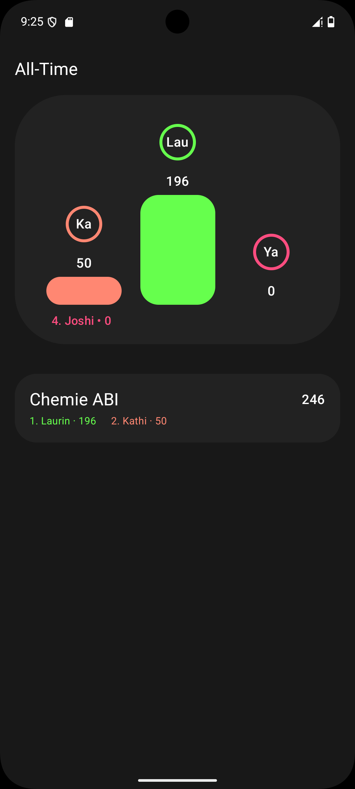
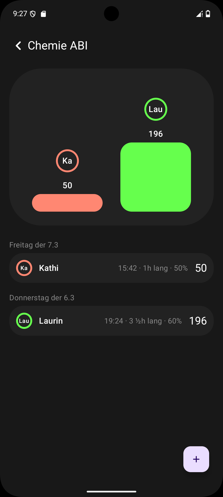

# Cole

Cole ist die Kurzform von Competitive Learing und das ist auch der Hauptanspruch.
Die Idee hinter der App ist, dass man mehr Motivation zum Lernen hat, wenn man sieht, wie viel andere Menschen um einen herum lernen.

## Screenshots

    
    

## API

Die API ist sowohl clientseitig als auch serverseitig nicht öffentlich, falls Interesse besteht, kann gerne ein Issue geöffnet werden